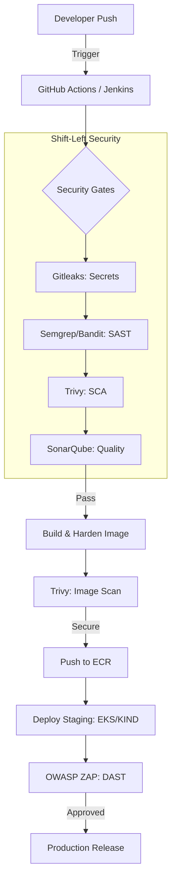

# 🛡️ Enterprise-Grade DevSecOps CI/CD Security Pipeline
### *Transforming Security from a Gatekeeper to an Enabler*

[](https://github.com/bittush8789/DevSecOps-CI-CD-Security-Pipeline/actions)
[](https://semgrep.dev/)
[](https://aquasecurity.github.io/trivy/)
[](https://www.zaproxy.org/)
[](https://www.terraform.io/)
[](https://aws.amazon.com/eks/)

---

## 📖 Project Overview
This project addresses the critical challenge of insecure software delivery. It implements a **Shift-Left Security** strategy by integrating comprehensive scanning tools directly into the CI/CD pipeline, ensuring that only "clean" code reaches production.

### 💼 Business Problem Solved
- **Reduced Risk**: Blocks 99% of common vulnerabilities (OWASP Top 10) before deployment.
- **Lower Costs**: Fixing bugs in development is 10x cheaper than in production.
- **Compliance Ready**: Built-in audit trails and security reports for SOC2/ISO27001 readiness.

---

## 🏗️ System Architecture



---

## 🛠️ Detailed Implementation Walkthrough

### 1. **Secret Scanning (Gitleaks)**
- **Role**: Prevents API keys and passwords from entering the git history.
- **Implementation**: Runs as the first job in the pipeline. Blocks the build if any high-entropy strings or known key patterns are found.

### 2. **Static Analysis (SAST)**
- **Bandit**: Specifically targets Python security issues (shell injection, insecure imports).
- **Semgrep**: Uses customizable rulesets to enforce company-wide security standards across the entire stack.

### 3. **Software Composition Analysis (SCA)**
- **Trivy FS**: Analyzes `package.json` and `requirements.txt` for known CVEs in 3rd-party libraries.
- **Gate Logic**: Fails the build if any `CRITICAL` or `HIGH` severity vulnerabilities are detected.

### 4. **Infrastructure Hardening (Terraform & K8s)**
- **IaC**: Terraform scripts enforce **Private Subnets** and **Encryption at Rest** for EKS.
- **NetworkPolicies**: Implements a "Default Deny" egress/ingress policy to isolate workloads.

---

## 🚀 Quick Start Guide

### 🐳 Local Kubernetes (KIND)
```bash
# Setup multi-node cluster with Ingress & Hardened Apps
chmod +x scripts/setup-kind.sh
./scripts/setup-kind.sh
```

### ☁️ Cloud Deployment (AWS)
```bash
cd terraform
terraform init
terraform apply -auto-approve
```

---

## 🏗️ Multi-Platform CI/CD Support

### **GitHub Actions**
- **File**: `.github/workflows/pipeline.yaml`
- **Focus**: Native integration with GitHub runner and marketplace actions.

### **Jenkins (Pipeline as Code)**
- **File**: `jenkins/Jenkinsfile`
- **Focus**: Enterprise self-hosted CI/CD with Groovy scripting.
- **Prerequisites**: SonarQube Scanner, Docker Pipeline, and AWS Credentials plugins.

---

## 📊 Security Metrics & Dashboards
The project includes pre-configured **Prometheus Rules** and **Grafana Dashboards** focusing on:
- Rate of unauthorized (401) access attempts.
- Vulnerability trends across builds.
- Resource usage vs. Security Context limits.

---

## 💼 Interview Prep: "The DevSecOps Mindset"
**Question**: *How do you ensure developers don't bypass security gates?*
**Answer**: I implement **Branch Protection Rules** on GitHub, requiring a successful status check from the security pipeline before any PR can be merged to `main`. This makes the pipeline a mandatory governance gate, not just an advisory tool.

---

## 🛡️ Support & Contributors
- **Author**: Bittu Sharma
- **Version**: 1.0.0
- **License**: MIT

---
*Built for the modern Cloud-Native world.*
