# 🛡️ Enterprise DevSecOps CI/CD Security Pipeline
### *The Gold Standard for Secure Software Delivery Life Cycle (SSDLC)*

[](https://github.com/bittush8789/DevSecOps-CI-CD-Security-Pipeline/actions)
[](https://semgrep.dev/)
[](https://aquasecurity.github.io/trivy/)
[](https://www.zaproxy.org/)
[](https://www.aicpa.org/topic/audit-assurance/audit-and-assurance-greater-than-soc-2)

---

## 📖 Executive Summary
This project represents a production-grade implementation of a **Shift-Left Security** strategy. By integrating security controls directly into the developer workflow, we transform security from a final bottleneck into a continuous, automated enabler of high-velocity releases.

### 💎 Key Business Value
- **Zero-Day Protection**: Continuous SCA scanning of 3rd-party dependencies.
- **Regulatory Alignment**: Automated evidence generation for SOC2, HIPAA, and GDPR audits.
- **Developer Productivity**: Immediate feedback on security hotspots during the PR phase.

---

## 🏗️ Architecture & Pipeline Flow

```mermaid
graph LR
    subgraph "Development"
    A[Code Push] --> B[Gitleaks: Secret Scan]
    end
    
    subgraph "CI: Quality & SAST"
    B --> C[Semgrep/Bandit: SAST]
    C --> D[SonarQube: Quality Gate]
    D --> E[Trivy FS: SCA]
    end
    
    subgraph "CD: Hardening & Deploy"
    E --> F[Hardened Docker Build]
    F --> G[Trivy Image: CVE Scan]
    G --> H[Deploy to EKS/KIND]
    end
    
    subgraph "Runtime: DAST & Observability"
    H --> I[OWASP ZAP: DAST]
    I --> J[Prometheus/Grafana]
    end
```



---

## 📁 Project Structure
```text
devsecops-pipeline/
├── .github/workflows/   # GitHub Actions (Security Gates)
├── backend/             # FastAPI Secure API (JWT, Rate Limiting)
├── frontend/            # Next.js 14 Premium UI
├── kubernetes/          # Hardened Manifests & Network Policies
├── terraform/           # IaC for AWS EKS & VPC
├── helm/                # Application Packaging
├── jenkins/             # Jenkins Pipeline-as-Code
├── monitoring/          # Security Dashboards & Rules
└── scripts/             # Setup & Deployment Automation
```

---

## 🛠️ Toolchain Implementation (Ubuntu/Debian)

### **1. Security Scanners**
| Tool | Installation | Strategic Role |
| :--- | :--- | :--- |
| **Gitleaks** | `wget ... && sudo mv gitleaks /usr/local/bin/` | Secret & Token Prevention |
| **Trivy** | `sudo apt install trivy` | SCA & Container CVE Analysis |
| **Semgrep** | `pip3 install semgrep` | Pattern-based SAST |
| **Bandit** | `pip3 install bandit` | Python-specific Security Audit |

### **2. Infrastructure**
| Tool | Installation | Strategic Role |
| :--- | :--- | :--- |
| **Terraform** | `sudo apt install terraform` | Immutable Infrastructure (IaC) |
| **kubectl** | `sudo install kubectl` | Cluster Orchestration |
| **KIND** | `curl -Lo ./kind ...` | Local Cluster Simulation |

---

## 🛑 Pipeline Gate Logic (Fail-Fast Strategy)
The pipeline is configured to **FAIL** if any of the following conditions are met:
- **Secrets Found**: Any high-entropy string detected by Gitleaks.
- **Critical CVEs**: Any `CRITICAL` or `HIGH` vulnerability found by Trivy.
- **Quality Gate Failure**: SonarQube reliability or security score falls below `A`.
- **Insecure Code**: SAST detection of SQL Injection, XSS, or Insecure Deserialization.

---

## 🚀 Deployment Guide

### **Local Testing (KIND)**
```bash
# Automated multi-node setup with Ingress
chmod +x scripts/setup-kind.sh
./scripts/setup-kind.sh
```

### **Cloud Provisioning (AWS)**
```bash
cd terraform
terraform init && terraform apply -auto-approve
```

---

## 💼 Professional Interview Talking Points
**Question**: *How do you handle 'Security Fatigue' among developers?*
**Answer**: I utilize **Baseline Scanning** and **Suppression Files**. We only block for `HIGH` and `CRITICAL` issues that are actionable, while providing educational links in the PR comments to help developers learn from the security findings.

---

## 🛡️ Support & Compliance
- **Author**: Bittu Sharma | **Version**: 2.0.0
- **Compliance**: SOC2 Type II (Standardized) | **License**: MIT

---
*Precision Engineered for Cloud-Native Security.*
