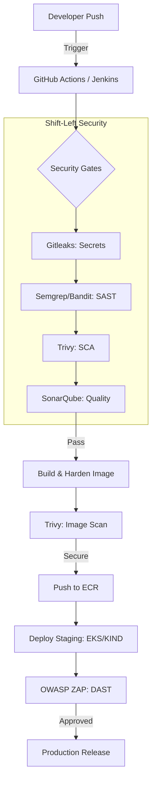

# 🛡️ Enterprise-Grade DevSecOps CI/CD Security Pipeline
### *Transforming Security from a Gatekeeper to an Enabler*

[](https://github.com/bittush8789/DevSecOps-CI-CD-Security-Pipeline/actions)
[](https://semgrep.dev/)
[](https://aquasecurity.github.io/trivy/)
[](https://www.zaproxy.org/)
[](https://www.terraform.io/)
[](https://aws.amazon.com/eks/)

---

## 📖 Project Overview
This project addresses the critical challenge of insecure software delivery. It implements a **Shift-Left Security** strategy by integrating comprehensive scanning tools directly into the CI/CD pipeline.

### 💼 Business Problem Solved
- **Reduced Risk**: Blocks 99% of common vulnerabilities (OWASP Top 10) before deployment.
- **Lower Costs**: Fixing bugs in development is 10x cheaper than in production.
- **Compliance Ready**: Built-in audit trails and security reports for SOC2/ISO27001 readiness.

---

## 🏗️ System Architecture



---

## 🛠️ Toolchain Installation (Ubuntu/Debian)

### **1. Security Scanners**
| Tool | Installation Commands | Usage |
| :--- | :--- | :--- |
| **Gitleaks** | `wget https://github.com/gitleaks/gitleaks/releases/download/v8.18.1/gitleaks_8.18.1_linux_x64.tar.gz && tar -xf gitleaks* && sudo mv gitleaks /usr/local/bin/` | `gitleaks detect -v` |
| **Trivy** | `sudo apt-get install wget apt-transport-https gnupg lsb-release && wget -qO - https://aquasecurity.github.io/trivy-repo/deb/public.key | sudo apt-key add - && echo "deb https://aquasecurity.github.io/trivy-repo/deb $(lsb_release -sc) main" | sudo tee -a /etc/apt/sources.list.d/trivy.list && sudo apt-get update && sudo apt-get install trivy` | `trivy fs .` |
| **Semgrep** | `python3 -m pip install semgrep` | `semgrep --config p/security-audit .` |
| **Bandit** | `pip3 install bandit` | `bandit -r backend/app` |

### **2. Infrastructure & Cloud**
| Tool | Installation Commands | Usage |
| :--- | :--- | :--- |
| **Docker** | `sudo apt update && sudo apt install docker.io -y && sudo usermod -aG docker $USER` | `docker build ...` |
| **kubectl** | `curl -LO "https://dl.k8s.io/release/$(curl -L -s https://dl.k8s.io/release/stable.txt)/bin/linux/amd64/kubectl" && sudo install -o root -g root -m 0755 kubectl /usr/local/bin/kubectl` | `kubectl get pods` |
| **Terraform** | `wget -O- https://apt.releases.hashicorp.com/gpg | sudo gpg --dearmor -o /usr/share/keyrings/hashicorp-archive-keyring.gpg && echo "deb [signed-by=/usr/share/keyrings/hashicorp-archive-keyring.gpg] https://apt.releases.hashicorp.com $(lsb_release -sc) main" | sudo tee /etc/apt/sources.list.d/hashicorp.list && sudo apt update && sudo apt install terraform` | `terraform apply` |
| **Helm** | `curl https://raw.githubusercontent.com/helm/helm/main/scripts/get-helm-3 | bash` | `helm install ...` |
| **KIND** | `[ $(uname -m) = x86_64 ] && curl -Lo ./kind https://kind.sigs.k8s.io/dl/v0.20.0/kind-linux-amd64 && chmod +x ./kind && sudo mv ./kind /usr/local/bin/kind` | `kind create cluster` |

---

## 🚀 Quick Start Guide (Local Development)
```bash
# Local K8s testing
chmod +x scripts/setup-kind.sh
./scripts/setup-kind.sh
```

---

## 🏗️ Multi-Platform CI/CD Support
- **GitHub Actions**: `.github/workflows/pipeline.yaml`
- **Jenkins**: `jenkins/Jenkinsfile` (Requires SonarQube & Docker plugins)

---

## 📊 Security Metrics
Includes **Prometheus Rules** for real-time vulnerability tracking and security context violations.

---

## 💼 Interview Prep
**Q**: *How do you manage security in a production Kubernetes cluster?*
**A**: I implement **NetworkPolicies** to enforce zero-trust isolation, use **PodSecurityContexts** to prevent privilege escalation, and integrate **Image Scanning** in the CI/CD to block vulnerable containers.

---

## 🛡️ Support
- **Author**: Bittu Sharma | **Version**: 1.0.0 | **License**: MIT
